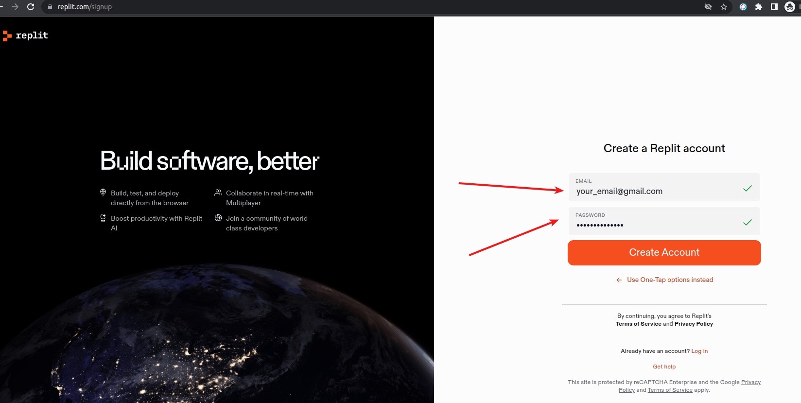

# Lekcja 0: Pierwszy program w Pythonie na Replit
## Dlaczego warto uczyć się Pythona?

Python to język programowania dla początkujących, który jest bardzo popularny na całym świecie. Jest prosty do zrozumienia i łatwy w nauce, a przy tym jest potężny i przydatny – można za jego pomocą pisać programy, robić gry, a nawet sterować robotami. Dlatego warto go poznać i nauczyć się nim posługiwać.

Zwróć uwagę, że uczymy się języka Python w wersji 3, ponieważ pozostałe wersje tego języka są już przestarzałe i nie są wspierane.


## Krok 1: Rejestracja na Replit
1. Wejdź na stronę [Replit](https://replit.com/).
2. Kliknij przycisk "Sign up" (Zarejestruj się) w prawym górnym rogu strony.
3. Wybierz "Continue with e-mail" i wypełnij wymagane pola.

4. Potwierdź swój adres e-mail, jeśli zostaniesz o to poproszony/a.

## Krok 2: Tworzenie nowego projektu
1. Po zalogowaniu się otworzy się okno, w którym wybierzesz swój poziom.
2. Wybierz język "Python".
3. Właśnie stworzyłeś/aś swój pierwszy Repl pod nazwą "Python".

## Krok 3: Pisanie kodu
1. W centralnym oknie zobaczysz miejsce, w którym możesz pisać swój kod.
2. Usuń wszelki kod, który może być tam już napisany.
3. Do wyświetlania informacji na ekranie w Pythonie służy funkcja `print()`.
   Kiedy wpisujemy `print("Hello World!")`, mówimy Pythonowi: "Hej, wydrukuj na ekranie te słowa w cudzysłowie". Ważne jest, aby pamiętać, że nie ma spacji między nazwą funkcji `print` a nawiasem otwierającym - są one zawsze zapisywane razem, bezpośrednio jeden za drugim, aby Python zrozumiał, że chcesz coś wydrukować.
```python
print("Hello World!")
```

## Krok 4: Uruchamianie kodu
1. Po wpisaniu kodu naciśnij zielony przycisk "Run" (Uruchom), który znajduje się w górnej części ekranu.
2. Na dole ekranu zobaczysz wynik działania twojego programu. Powinien wyglądać tak:

Hello World!

**Gratulacje!** Właśnie napisałeś/aś i uruchomiłeś/aś swój pierwszy program w Pythonie na Replit!

## Zadania

### Zadanie 1: Wyświetlanie informacji na ekranie

1. Wyświetl na ekranie swoje imię.
2. Wyświetl na ekranie swój wiek.
3. Wyświetl na ekranie swoje ulubione zwierzę.
