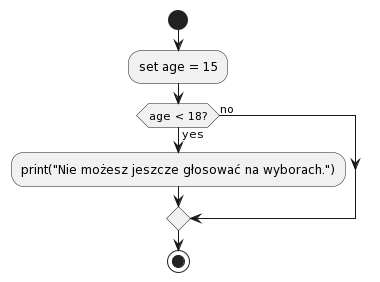

# Lekcja 4: Operatory warunkowe

W tej lekcji przyjrzymy się, jak tworzyć konstrukcje warunkowe w Pythonie, aby program mógł podejmować różne decyzje w zależności od określonych warunków.

## Operator if

Operator `if` pozwala sprawdzić warunek i wykonać blok kodu, jeśli warunek jest prawdziwy.

Przykład:

```python
age = 15

if age < 18:
    print("Nie możesz jeszcze głosować na wyborach.")
```
Warunek dobrze wizualizuje się przy pomocy diagramu blokowego

**Diagram blokowy** to graficzne przedstawienie algorytmu lub procesu, 
używające różnych geometrycznych kształtów do oznaczania różnych rodzajów instrukcji, oraz strzałek wskazujących kierunek przepływu wykonania. 

Każdy kształt w diagramie blokowym reprezentuje konkretny typ operacji, na przykład prostokąty są często używane do operacji (lub działań), a romby - do podejmowania decyzji.



## Operatory elif i else

`elif` jest używany do sprawdzania dodatkowych warunków, jeśli poprzedni warunek był fałszywy. `else` wykonuje się, gdy żaden z poprzednich warunków nie był prawdziwy.

Przykład:

```python
weather = "słonecznie"

if weather == "deszcz":
    print("Weź parasol!")
elif weather == "słonecznie":
    print("Nie zapomnij o kremie z filtrem!")
else:
    print("Przygotuj się na każdą pogodę!")
```

## Zagnieżdżone warunki (bloki z wcięciem)

Czasami warunki mogą być zagnieżdżone, co pozwala na tworzenie bardziej skomplikowanych konstrukcji logicznych.

Przykład:

```python
age = 16
has_permission = True

if age < 18:
    if has_permission:
        print("Możesz wejść, ale tylko z dorosłym.")
    else:
        print("Niestety, nie możesz wejść.")
else:
    print("Witamy!")
```


---

## Zadania do lekcji 4: Operatory warunkowe

### Zadanie 1: Operator if

1. Stwórz zmienną z wartością liczbową.
2. Używając operatora `if`, sprawdź, czy twoja liczba jest większa niż 10 i wyświetl odpowiedni komunikat.

### Zadanie 2: Operatory elif i else

1. Stwórz zmienną zawierającą aktualną temperaturę powietrza.
2. Używając `if`, `elif` i `else`, wyświetl komunikat o tym, co należy ubrać (na przykład, jeśli temperatura jest poniżej 0, to "Ubierz się ciepło", jeśli od 0 do 15 — "Weź kurtkę" itd.).

### Zadanie 3: Zagnieżdżone warunki

1. Stwórz dwie zmienne boolowskie: `is_student` i `has_discount_card`.
2. Używając zagnieżdżonych warunków, określ, ile student powinien zapłacić za bilet do kina (na przykład, podstawowa cena to 10 dolarów, studenci płacą o 2 dolary mniej, a jeśli student ma jeszcze kartę rabatową, to płaci o dolar mniej).
