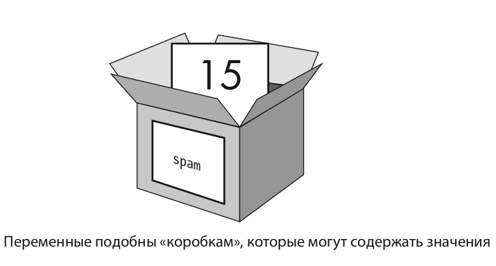

# Lekcja 1: Podstawy pracy z zmiennymi

W tej lekcji przyjrzymy się podstawom pracy ze zmiennymi w Pythonie. Zmienne to fundament każdego programu i zrozumienie, jak działają, jest niezwykle ważne dla początkującego programisty.

## Wyświetlanie informacji na ekranie

Aby wyświetlić informacje na ekranie w Pythonie, używamy funkcji `print()`.
Już wykorzystaliśmy ją w poprzedniej lekcji.

:warning:TODO wyjaśnić, co dzieje się wewnątrz funkcji `print()` i zwrócić uwagę, że nie ma spacji między `print` a nawiasami.

Przykład:
\```python
print("Hello, World!")
\```
Kiedy uruchomisz ten kod, na ekranie pojawi się napis "Hello, World!".

## Deklaracja zmiennych

Zmienna to sposób na zapisywanie danych do ich późniejszego wykorzystania. 
Możesz sobie wyobrazić, że zmienna to rodzaj "pudełka", w którym możesz przechowywać wartości.
Aby zapisać wartość wyrażenia w zmiennej, użyj instrukcji przypisania. 
Wpisz nazwę zmiennej, potem znak równości (=), który nazywamy operatorem przypisania, i na końcu wartość. Na przykład, wpisz następujące polecenie w interaktywnym środowisku Pythona:
\```python
spam = 15
\```


:warning:TODO zwrócić uwagę na to, że spacje są wokół znaku równości.

Teraz spróbujmy zapisać w zmiennej tekst zamiast liczby.
Przykład:
\```python
name = "Anna"
surname = "Pietrowa"
\```
W tym przykładzie utworzyliśmy zmienną o nazwie `name` i przypisaliśmy jej wartość "Anna",
a także utworzyliśmy zmienną o nazwie `surname` i przypisaliśmy jej wartość "Pietrowa".

Używamy angielskich liter dla nazw zmiennych, co sprawia, że język jest uniwersalny dla wszystkich programistów na świecie.
Zawartość zmiennej może być w dowolnym języku.

## Zasady i wskazówki dotyczące nazywania zmiennych:

📛 **Nazwa zmiennej powinna być zrozumiała:**  
Używaj nazw, które pomogą tobie i innym zrozumieć, do czego służy zmienna. Na przykład, `score` dla wyniku w grze.

🔡 **Używaj tylko liter, cyfr i podkreśleń:**  
Zmienne mogą zawierać tylko litery (a-z, A-Z), cyfry (0-9) i podkreślenia (_). Na przykład, `player1_score`.

🚫 **Nie zaczynaj nazwy od cyfry:**  
Nazwa zmiennej nie może zaczynać się od cyfry. Więc `1st_player` jest nieprawidłowe, ale `first_player` lub `player1` są poprawne.

🐫 **Używaj podkreślenia dla złożonych nazw:**  
Jeśli nazwa zmiennej składa się z kilku słów, łącz je za pomocą podkreślenia, na przykład `player_name` lub `game_score`.

🔠 **Wielkość liter ma znaczenie:**  
Pamiętaj, że `score` i `Score` to dwie różne zmienne, ponieważ Python rozróżnia wielkość liter.

🚷 **Unikaj używania słów kluczowych:**  
Są słowa, które Python używa dla swoich celów, na przykład `print
