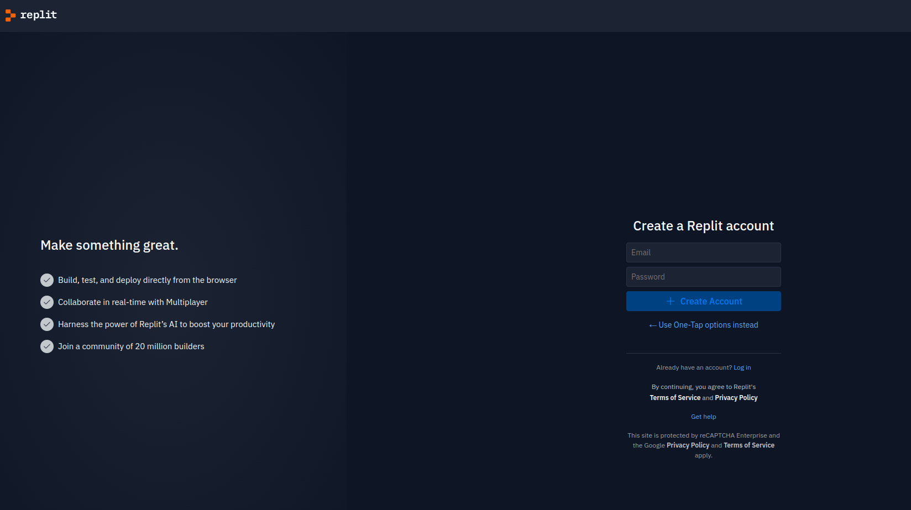

# Инструкция по написанию первой программы на Python в Replit
:warning: Мы изучаем язык Python3 так как остальные версии языка устарели и не поддерживаются

## Шаг 1: Регистрация на Replit
1. Перейдите на сайт [Replit](https://replit.com/)
2. Нажмите на кнопку "Sign up" (Зарегистрироваться) в верхнем правом углу.
   рекомендую создавать новый аккаунт через почту, потому что регистрация по кнопке через Google иногда не срабатывает
   
4. Заполните необходимые поля или зарегистрируйтесь.
5. Подтвердите свой адрес электронной почты, если это потребуется.

## Шаг 2: Создание нового проекта
1. После регистрации и входа в аккаунт нажмите на кнопку "+ New Repl" (Новый Repl).
2. В открывшемся окне выберите язык "Python". 
3. Дайте название вашему проекту, например, "Sasha_python".
4. Нажмите на кнопку "Create Repl" (Создать Repl).

## Шаг 3: Написание кода
1. В центральном окне вы увидите текстовый редактор. Здесь вы будете писать свой код.
2. Удалите любой предварительно написанный код, если он есть.
3. Введите следующий код:
   ```python
   print("Hello, World!")
   ```

## Шаг 4: Запуск кода
1. После того как вы ввели код, нажмите на зеленую кнопку "Run" (Запустить) в верхней части экрана.
2. В нижней части экрана вы увидите результат выполнения вашей программы. Он должен выглядеть так:

Hello, World!

**Поздравляем!** Вы только что написали и запустили свою первую программу на Python в Replit!

## Шаг 5: Создание папок под урок
1. Если ваша цель прохождение курса, то хранить все файлы в перемешку не лучший вариант, я рекомендую создавать под каждый урок отдельную папку.

2. Eсли файл .py лежит в папке, то запуск кода через кнопку Run сломается. Чтобы починить его нужно
   a) сделать так чтобы показывались скрытые файлы
   б) найти файл .replit перейти в нем на строку
   entrypoint = "main.py"
   если мы хотим запустить файл main.py который лежит в папке lesson1
   то прописываем 
   entrypoint = "lesson1/main.py"

